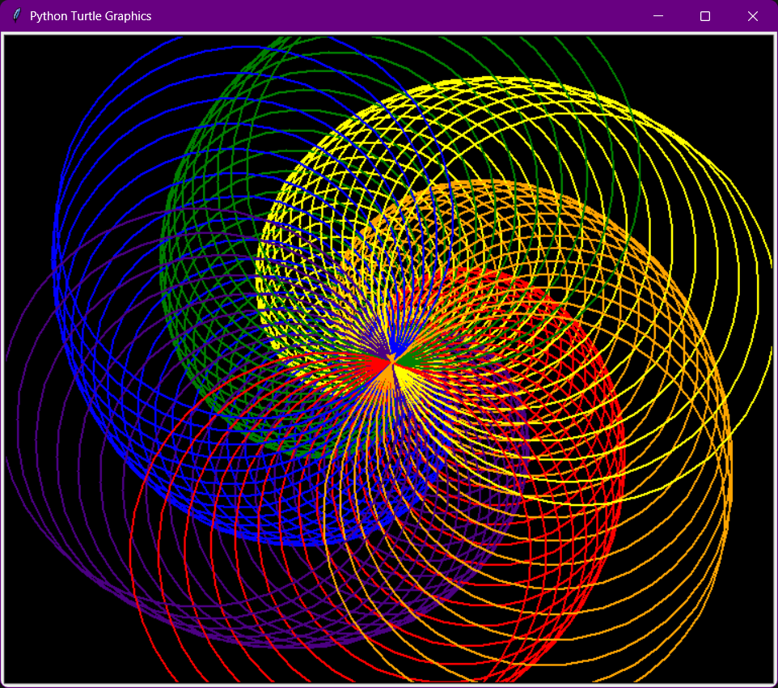

<!--
  README.md
  For: willow788/turtles-all-the-way-down
  Last update: 2026-01-09
-->
<div align="center">

# 🐢 Turtles All The Way Down 🌈

### *A mesmerizing journey into recursive beauty through Python's Turtle Graphics*

[](https://python.org)
[](LICENSE)




*"Where mathematics meets art, one circle at a time"*

</div>

---

## 📚 Table of Contents

- [Overview](#-overview)
- [Gallery of Patterns](#-gallery-of-patterns)
- [Project Structure](#-project-structure)
- [Quick Start](#-quick-start)
- [How the Code Works](#-how-the-code-works)
- [Customization Tips](#-customization-tips)
- [Learning Outcomes](#-learning-outcomes)
- [Contributing](#-contributing)
- [Ideas for Enhancement](#-ideas-for-enhancement)
- [License](#-license)
- [Author](#-author)

---

## 🎨 Overview

**Turtles All The Way Down** is a Python collection that brings math-inspired art to life using the classic Turtle Graphics library. Each script within this repo generates unique, colorful geometric patterns—spirals, hearts, sunbursts, cardioids, petal formations, and beyond.

> *"It's turtles all the way down."*  
> —A reference to infinite recursion and the beautiful depth of mathematical creativity

Whether you're an educator, artist, student, or Pythonista—explore, experiment, and expand upon these patterns to find your own mathematical art style!

---

## 🖼️ Gallery of Patterns

| Spirals | Multi-heart Patterns | Random Petal Generator | Rotating Cardioid | Sunburst Lines | Triggraphy |
|:---:|:---:|:---:|:---:|:---:|:---:|
|  | <details><summary>Show Example</summary><br>Generates multiple overlapping hearts in dazzling colors, fanning out to create a burst of love.<br></details> | <details><summary>Show Example</summary><br>Draws flower petals with randomness and vibrant colors.<br></details> | <details><summary>Show Example</summary><br>Creates beautiful cardioid curves that rotate with color.<br></details> | <details><summary>Show Example</summary><br>Radiant sunburst lines emanating from a circle.<br></details> | <details><summary>Show Example</summary><br>Explore more trigonometric beauty in TRIGGRAPHY!<br></details> |

<details>
  <summary><b>See all code modules!</b></summary>

- <b>Spirals:</b> Colorful recursive spirals in <code>Spirals Code/main.py</code>
- <b>Multi-heart Patterns:</b> Overlapping heart shapes in <code>Multi-heart Patterns/multiheart.py</code>
- <b>Random Petal Generator:</b> Lush, petal-like curves in <code>Random Petal Generator/petal.py</code>
- <b>Rotating Cardioid pattern:</b> Mesmerizing, rotating cardioids in <code>Rotating Cardioid pattern/rotate.py</code>
- <b>Sunburst Lines from a circle edge:</b> Radiant sun lines in <code>Sunburst Lines from a circle edge/main.py</code>
- <b>TRIGGRAPHY:</b> Trigonometric pattern playground
</details>

---

## 🗂️ Project Structure

```
turtles-all-the-way-down/
├── Spirals Code/
│   ├── main.py               # Main spiral generator
│   └── explanation.txt       # Spiral drawing explanation
├── Multi-heart Patterns/
│   └── multiheart.py         # Overlapping multiple hearts
├── Random Petal Generator/
│   └── petal.py              # Random color floral patterns
├── Rotating Cardioid pattern/
│   └── rotate.py             # Cardioid curves with rotation
├── Sunburst Lines from a circle edge/
│   └── main.py               # Sunburst pattern generator
├── TRIGGRAPHY/               # Space for more trig-based patterns
├── Demonstration/
│   ├── Spirals.png           # Example output
│   └── message.txt           # Inspirational project note
├── README.md
├── LICENSE                   # MIT License
└── .gitignore
```

Each major directory contains Python scripts for geometric art, plus demonstrations and notes as available.

---

## 🚀 Quick Start

### Prerequisites

- Python 3.x installed (no extra packages required—uses the built-in `turtle` module)

### Installation & Running

```bash
# Clone the repository
git clone https://github.com/willow788/turtles-all-the-way-down.git

# Enter the desired module's directory, for example:
cd turtles-all-the-way-down/Spirals\ Code

# Run the main script
python main.py
```

You can substitute `Spirals Code` with `Multi-heart Patterns`, `Random Petal Generator`, etc.

---

## 🧑‍💻 How the Code Works

All scripts use Python's Turtle Graphics to draw mathematically-driven art. Here’s how the **Spirals Code** module works, for example:

```python
colors = ["#BA0505", "#A06903", "#CECE1D", "#0DB686", "#101076", "#41aa0d", "#D51DAD"]

for i in range(200):
    t.color(colors[i % len(colors)])   # Cycle color
    t.circle(i)                        # Incremental radius
    t.left(59)                         # Creates spiral form
```

Explore each module’s `.py` and `.txt` files for fun mathematical and coding insights!

---

## 🛠️ Customization Tips

Try editing these for creative new effects:

- **Cycles:** `range(200)` — More or fewer iterations for denser/lighter patterns.
- **Rotation:** `t.left(59)` — Try other angles for new forms.
- **Colors:** Add/replace hex color codes in the palette.
- **Background:** `turtle.bgcolor("black")` — Set to any color you want!
- **Module scripts:** Nearly every pattern accepts tweaks—edit scale, noise, angle, or color.

> 💡 _Check out the “explanation.txt” and inline comments for hints!_
---

## 🎓 Learning Outcomes

- ✅ Python turtle graphics fundamentals
- ✅ Geometric pattern generation
- ✅ Color theory applied in code
- ✅ Mathematical recursion and trigonometry
- ✅ Creative coding and algorithmic art

---

## 🤝 Contributing

Contributions, feature requests, and issue reports are welcome!

1. Fork this repo
2. Create a feature branch: `git checkout -b feature/YourAmazingPattern`
3. Make your changes (add scripts, docs, or improvements)
4. Commit: `git commit -m "Describe your changes"`
5. Push: `git push origin feature/YourAmazingPattern`
6. [Open a Pull Request](https://github.com/willow788/turtles-all-the-way-down/pulls)

See something magical in math or art? Let’s build it together! 🌠

---

## 💡 Ideas for Enhancement

- [ ] Add command-line arguments for easy customization
- [ ] Animate pattern morphing in real time
- [ ] Save/export art as SVG or PNG
- [ ] Create a GUI for live parameter tweaking
- [ ] Add educational “math behind the art” popups
- [ ] Encourage more community-contributed patterns

---

## 📜 License

This project is licensed under the MIT License. See [LICENSE](LICENSE) for details.  
<sub>© 2026 SRIJA DE CHOWDHURY</sub>

---

## 👩‍💻 Author

**willow788**

- GitHub: [@willow788](https://github.com/willow788)

---

<div align="center">

⭐️ _If you enjoyed this mathematical art gallery, star the repo and share your patterns!_  
_Made with 💜 and Python Turtle Graphics_

</div>
